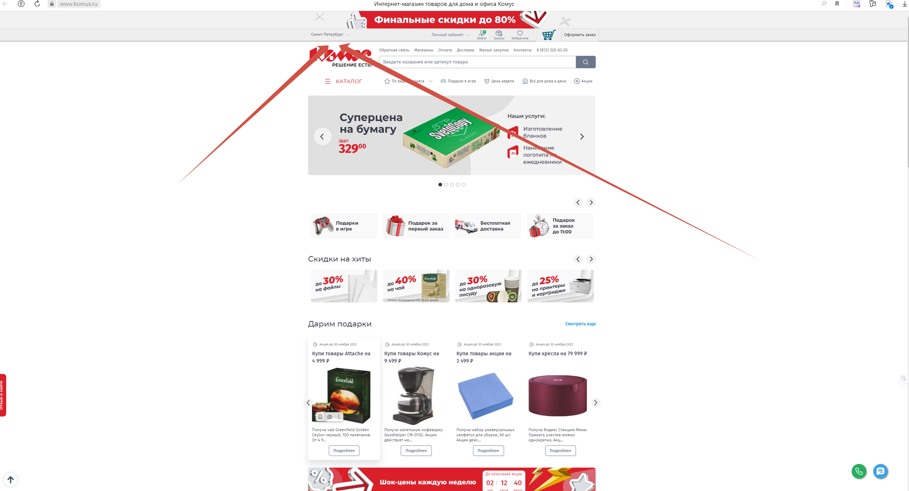

# 1. business.sbermarket.ru

## Запускаем программу pool.py
    -процесс открывает 6 программ.
    -в каждоый программе нужно установить адрес выгрузки

    -LinkForLinks.txt, файл содержащий ссылки, которые можно добовлять или убирать 
    (важно, что бы ссылки были именно такого же формата, как в файле. 
    Скопируйте ссылку из файла и втавте в бразуезр что бы не ошибиться. В файле не должно быть пробелов, последння строка не должна быть пустой)

# 2. mshop.metro-cc.rushop.ru__
##  Запускаем MetroParsing.py
    -программа проходит по каждому кобинету и собирает информацию
    -ссылки можно добавить в файл LinksForMetro.txt
    (важно, что бы ссылки были именно такого же формата, как в файле. 
    Скопируйте ссылку из файла и втавте в бразуезр что бы не ошибиться. В файле не должно быть пробелов, последння строка не должна быть пустой)
    -Программа сохраняет нам HTML Документ страниц.
## После окончание MetroParsing.py мы запускаем MetroHTWorker
    -программа разбивает нам файл HTML на файл CSV для дальнешей обработки

# 3. komus.ru
## Запускаем программу KomusParsing.py
    -При запуске программы нужно перейти по ссылке Region.txt в браузере, для установки региона:

    -затем нам нужно забрать Coockie страницы

    -Cookie находяться во вкладке Network, в погружаемом элементе homepage

    -Мы капируем Cookie с и вводим их в страку при запуске программы 

    -И так для каждой ссыли из файла

    -(важно, что бы ссылки были именно такого же формата, как в файле. 
    Скопируйте ссылку из файла и втавте в бразуезр что бы не ошибиться. В файле не должно быть пробелов, последння строка не должна быть пустой)

**Программа может не завершиться автоматически, из за этого её нужно останавливать в ручную и переходить к следующией ссылке**
